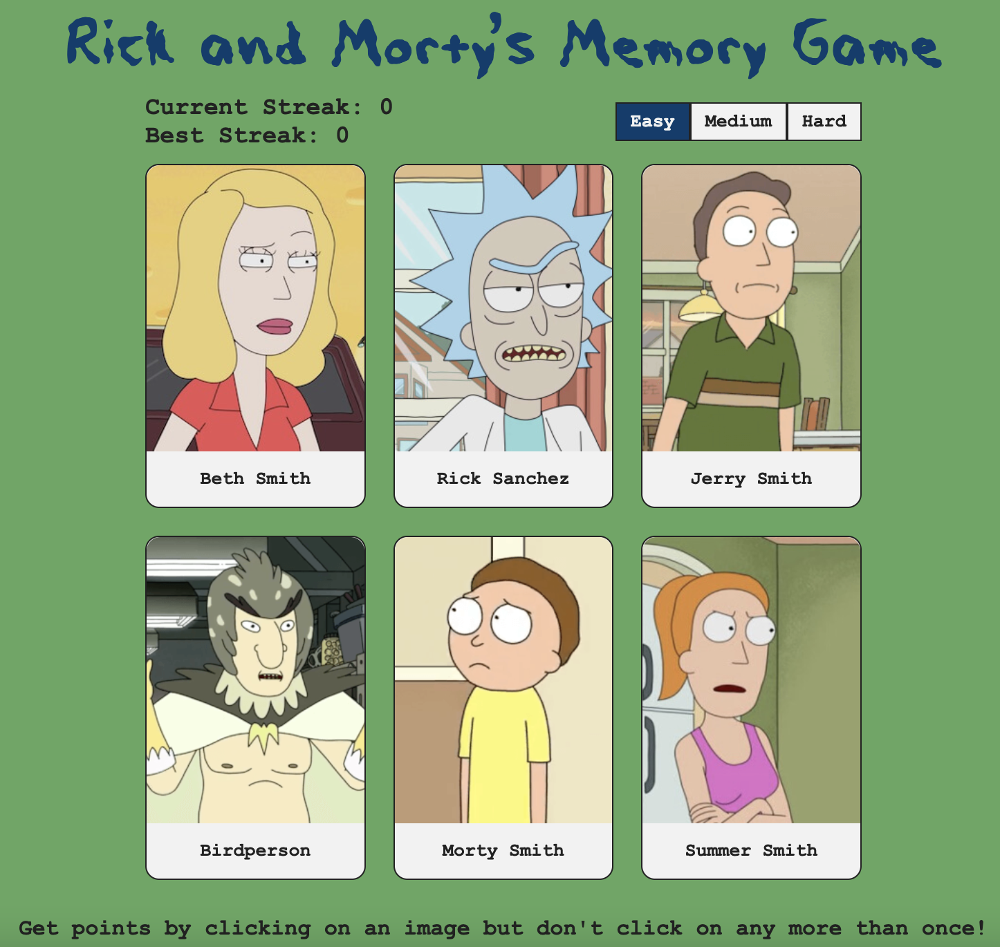
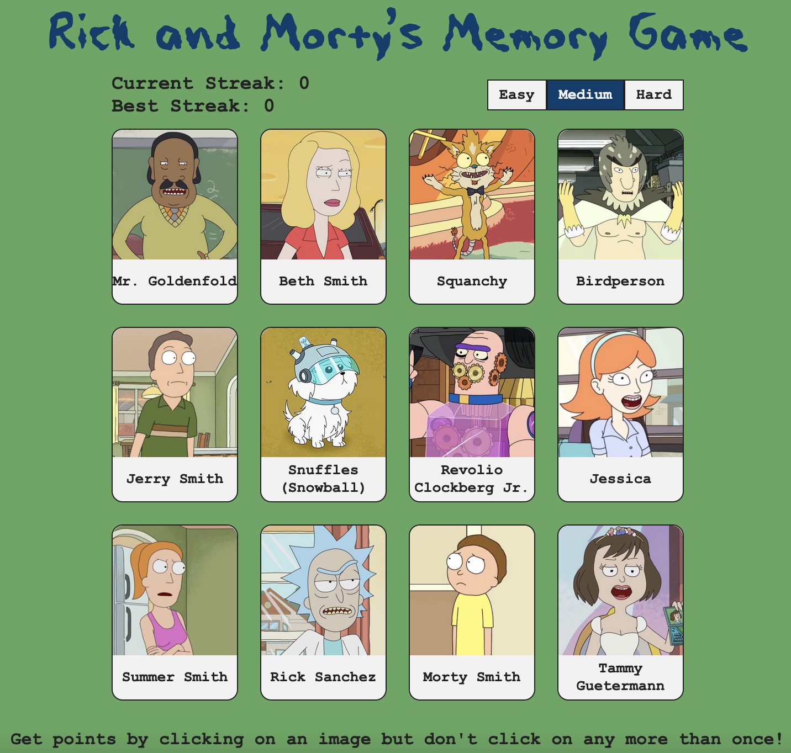
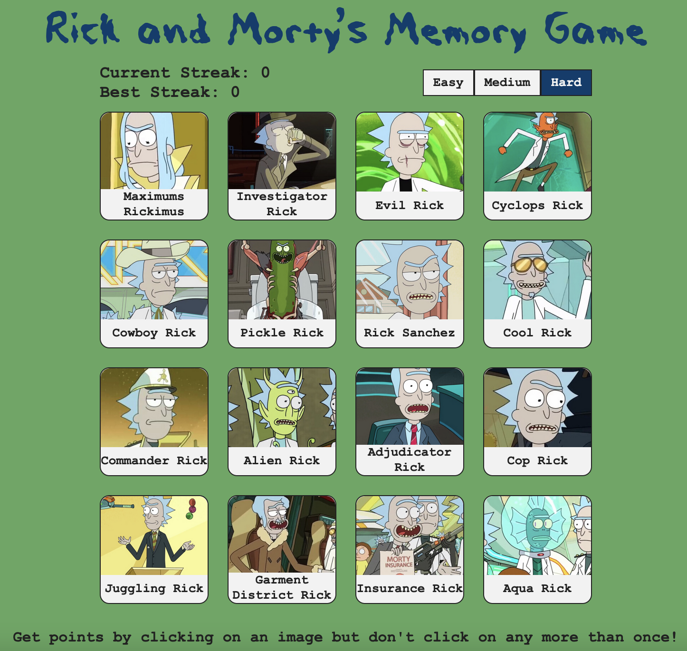

# Memory Game

[Live Demo](https://rick-and-mortys-memory-game.netlify.app/)

## Overview

A web-based memory card game built with React. The objective is to click each character only once - clicking the same character twice looses the game! Character images and names are pulled from [RickAndMortyApi.com](https://rickandmortyapi.com/). It is hosted on Netlify.

## Features

- 3 difficulty levels (Easy, Medium, Hard)
- Score tracking and high score disply
- Random card shuffle after each selection
- Red highlight on incorrect selections
- Victory screen upon selecting all unique cards

## Preview

### Easy Difficulty (6 cards)



### Medium Difficulty (12 Cards)



### Hard Difficulty (18 Cards)



## How to Run Locally

1. Clone the repository

```bash
git clone git@github.com:zwhahn/react-cv.git
cd react-cv
```

2. Install dependencies and start the development server

```bash
npm install
npm run dev
```

3. Open browser and navigate to: [http://localhost:5173](http://localhost:5173)

## Tech Stack

- React
- Vite
- JavaScript
- CSS
- Netlify
- REST API (Rick and Morty API)
